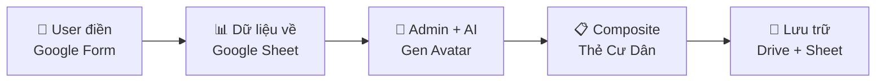
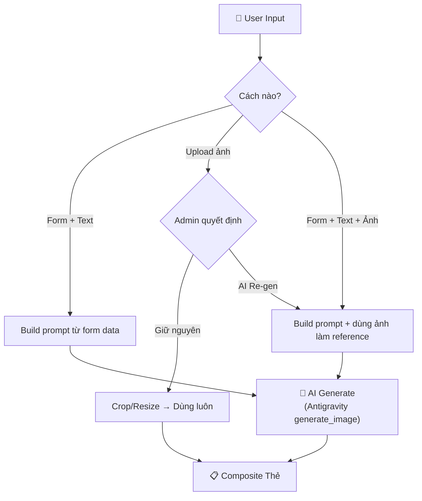
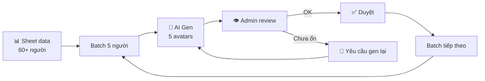

# 🏘️ Thẻ Cư Dân Làng Xì Trum - Team Building Card Generator

## Bối cảnh
Đây là dự án phục vụ **team building 60+ người**. Mỗi thành viên sẽ có một **Thẻ Cư Dân** (Resident Card) với nhân vật Smurf đại diện, mang bản sắc riêng nhưng thống nhất style 2D chuẩn Smurf.

**⏰ Timeline: 1 tuần** để hoàn thiện toàn bộ hệ thống.

Dựa trên phác thảo gốc (conversation `9f492a78`, 02/07), assets cũ (modular layer) **đã bị loại bỏ** vì không đạt chất lượng mong muốn.

## Phương án đề xuất: "Form + Text + Ảnh → AI Gen Full Character"

### Quy trình tổng thể



---

## Tính năng 1: Google Form Đăng Ký Cư Dân

Dùng **Google Form** → dữ liệu tự động về **Google Sheet** luôn, không cần build form riêng.

### Thông tin cá nhân
| Field | Kiểu | Ví dụ |
|-------|------|-------|
| Tên Xì Trum | Text (tiền tố "Tí") | Tí Lực Điền, Tí Nhí Nhảnh |
| Phụ đề tên thật | Text | Nguyễn Văn A |
| Nhóm | Dropdown (cố định) | N1T1, N1T2, N1T3, N1T4, N1T5, N2T1, N2T2, N2T3, N2T4, N2T5 |
| Giới tính | Radio | Nam / Nữ |
| Sở thích | Tags chọn nhiều | Lập trình, Nấu ăn, Đọc sách... |
| Điểm mạnh | Text ngắn | Kiên nhẫn, Sáng tạo |
| Điểm yếu | Text ngắn | Hay quên, Ngại nói trước đám đông |
| Tính cách | Tags | Hài hước, Trầm tính, Năng động... |
| Tự giới thiệu | Textarea | 1-2 câu mô tả bản thân |

### Tùy chỉnh nhân vật Smurf

> [!NOTE]
> Mỗi field đều có **options gợi ý** để user chọn nhanh, nhưng **luôn cho phép tự điền** nếu muốn thứ khác. Mọi field đều có lựa chọn **"Không"**.

| Field | Options gợi ý (+ cho phép tự điền) |
|-------|-------------------------------------|
| Giới tính Smurf | Không / Nam (Smurf) / Nữ (Smurfette) / _Tự điền_ |
| Kiểu mũ | Không / Mũ trắng cổ điển / Mũ đỏ (Papa) / Mũ hoa / Không mũ + tóc / _Tự điền_ |
| Màu mũ/phụ kiện | Không / Trắng / Đỏ / Vàng / Hồng / Tím / Xanh lá / _Tự điền_ |
| Màu tóc | Không / Vàng (Smurfette) / Đen / Nâu / Đỏ / Xanh / _Tự điền_ |
| Phụ kiện mặt | Không / Kính tròn / Kính râm / Mặt nạ / _Tự điền_ |
| Trang phục | Không / Quần trắng cổ điển / Váy / Áo yếm / Áo bếp / Cape / _Tự điền_ |
| Đạo cụ cầm tay | Không / Sách / Cờ lê / Guitar / Ống nghiệm / Bút vẽ / Laptop / _Tự điền_ |
| Biểu cảm | Không / Vui vẻ / Ngầu / Dễ thương / Nghiêm túc / Tinh nghịch / _Tự điền_ |
| Pose | Không / Đứng thẳng / Vẫy tay / Giơ ngón cái / Khoanh tay / _Tự điền_ |
| Background | Không / Làng Xì Trum / Rừng nấm / Phòng thí nghiệm / Bếp / Sân khấu / _Tự điền mô tả_ |

> [!TIP]
> **Field Background**: Nếu user điền mô tả → gen avatar với background đó. Nếu chọn "Không" hoặc bỏ trống → AI sẽ tự generate background phù hợp với mô tả nhân vật Smurf của user (VD: Smurf đầu bếp → background bếp, Smurf lập trình → background phòng làm việc).

### Field bổ sung (nếu có)
> Ô textarea **tùy chọn** để user bổ sung thêm chi tiết đặc biệt mà các field ở trên chưa cover.
> VD: "Tui muốn Smurf mình đeo tai nghe gaming, có xăm hình ngôi sao ở tay"

### 📎 Upload ảnh tham khảo (Tùy chọn)

> Thành viên có thể **nộp file ảnh** Smurf mà mình mong muốn (ảnh tìm trên mạng, ảnh tự vẽ, ảnh AI gen sẵn, v.v.)
>
> **Lưu ý cho user**: Ảnh này sẽ được Admin sử dụng làm tham khảo. Để đảm bảo tính đồng nhất cho toàn bộ thẻ cư dân trong Làng, Admin **có thể sẽ dùng AI để generate lại** dựa trên ảnh bạn nộp, giữ nguyên ý tưởng nhưng thống nhất phong cách chung.

Kèm theo ảnh, có thêm **1 ô text tự do** để user ghi chú về ảnh (VD: "Tui thích cái mũ trong ảnh này nhưng muốn đổi màu đỏ").

Sau khi nhận ảnh, **Admin quyết định**:

| Quyết định | Khi nào dùng | Xử lý |
|------------|-------------|-------|
| ✅ **Giữ nguyên** | Ảnh đã đúng style, đẹp, phù hợp | Dùng trực tiếp làm avatar trên thẻ (chỉ crop/resize) |
| 🔄 **AI Re-generate dựa trên ảnh** | Ảnh hay nhưng lệch style hoặc chất lượng thấp | AI nhận ảnh làm reference → gen lại theo style chuẩn, giữ ý tưởng gốc |
| ❌ **Yêu cầu nộp lại** | Ảnh không phù hợp hoặc không liên quan | Gửi feedback cho user để nộp ảnh/mô tả khác |

**Lợi ích:**
- Người không giỏi mô tả bằng chữ có thể dùng hình ảnh trực quan
- Admin kiểm soát được chất lượng cuối cùng
- AI có thể dùng ảnh nộp làm **style reference** → kết quả chính xác hơn so với chỉ dùng text
- Linh hoạt: ai tìm được ảnh sẵn đẹp rồi thì khỏi gen, tiết kiệm thời gian

---

## Tính năng 2: AI Generation Pipeline

**Engine chính**: `generate_image` tool built-in của Antigravity (đã có sẵn).

Hệ thống xử lý **3 luồng đầu vào** tùy theo cách user cung cấp thông tin:



### Bước 1: Chuẩn hóa Prompt & Nguyên tắc Style Ảnh
Hệ thống tự động build prompt từ dữ liệu form kết hợp với các nguyên tắc style cố định để đảm bảo chất lượng hình ảnh đồng nhất.

#### 1. Style Anchor (Luôn cố định trong prompt)
```
"2D cartoon Smurf character, classic Peyo art style, blue skin, big round nose, clean black outlines, solid flat colors, consistent proportions matching original Smurfs animated series"
```

#### 2. Nguyên tắc Bố cục & Camera (Tránh lỗi crop/zoom)
- **Tập trung chi tiết vào trục dọc 3:4 ở giữa (Center-heavy details)**: Tất cả các chi tiết quan trọng nhất (chữ tiêu đề 2 dòng, toàn thân nhân vật, đạo cụ chính) phải được dồn hoàn toàn vào trục dọc 3:4 ở chính giữa bức ảnh (chiếm 75% chiều rộng ở trung tâm, tức 768px ở giữa canvas 1024px). Hai bên rìa ngoài (mỗi bên rộng khoảng 12.5% tương đương 128px) chỉ chứa cảnh nền phụ hoặc tường gỗ không quan trọng để khi crop sang 3:4 không bị mất chi tiết.
- **Dáng đứng toàn thân (Full-body standing pose)**: Luôn yêu cầu camera lấy toàn bộ nhân vật từ đầu đến chân (hiển thị từ mũ trắng đến đôi giày trắng trên sàn nhà). Không dùng close-up hoặc ảnh cận mặt/nửa người.
- **Tỉ lệ nhân vật**: Nhân vật đứng ở giữa hoặc nửa dưới bức ảnh, chiếm khoảng 70% chiều cao để chừa khoảng trống phía trên cho tiêu đề.

> [!CAUTION]
> **QUY TẮC BẮT BUỘC VỀ TỶ LỆ 3:4 VÀ VÙNG AN TOÀN CHỮ:**
> 1. Ảnh đầu ra luôn được crop về **tỷ lệ 3:4 dọc (768×1024)** từ ảnh vuông 1024×1024 bằng script `crop_3_4.py`.
> 2. **TOÀN BỘ chữ tiêu đề (cả "Tí" lẫn tên đặc điểm)** phải nằm **hoàn toàn bên trong** vùng an toàn 3:4 (từ x=128 đến x=896 trên canvas vuông 1024×1024). Không một nét chữ, viền chữ, hay đuôi chữ cách điệu nào được phép tràn ra ngoài ranh giới này.
> 3. Để đảm bảo an toàn, mọi nét chữ nên nằm trong **vùng an toàn thu hẹp 60% chiều rộng ở giữa** (từ x=205 đến x=819), cách mỗi bên rìa crop ít nhất 77px.
> 4. Nếu tên đặc điểm dài (ví dụ: "Mèo Mun", "Bác Sĩ"), phải viết chữ **nhỏ gọn hơn** thay vì kéo dài chữ ra ngoài rìa.

#### 3. Nguyên tắc Chữ cách điệu (Stylized Typography)
- **Bố cục 2 dòng (2-line stacked layout)**:
  * **Dòng trên (Line 1)**: Luôn là chữ **"Tí"** bắt buộc viết bằng **màu TRẮNG nguyên bản (solid pure white color, không ngoại lệ)**, kiểu font béo tròn màu trắng viền xanh dương đậm (classic bubbly Smurfs logo font) và **có thêm một lớp viền ngoài màu trắng dày (thick white outer stroke/contour)** bao quanh nét viền xanh dương để tạo độ dày nổi bật và tách biệt hoàn toàn khỏi bối cảnh.
  * **Dòng dưới (Line 2)**: Tên đặc điểm hoặc nghề nghiệp (VD: "Bác Sĩ", "Mã Code") được cách điệu theo chủ đề tương ứng.
- **Tích hợp tự nhiên**: Tiêu đề tên Xì Trum phải được đặt gọn gàng và chỉ thể hiện trong tối đa **1/3 (33%) diện tích chiều cao phía trên cùng** của ảnh avatar, lồng ghép trực tiếp vào bối cảnh phòng. Nửa dưới (2/3 chiều cao còn lại) dành trọn vẹn cho nhân vật và các đạo cụ/chi tiết nền khác.
- **Không tràn chữ (No text overflow)**: Không cho phép bất kỳ nét chữ nào (bao gồm viền ngoài, bóng đổ, đuôi cách điệu) vượt quá ranh giới vùng an toàn 3:4. Nếu tên đặc điểm quá dài, phải giảm cỡ chữ hoặc xuống dòng thay vì mở rộng chiều ngang.
- **Không dùng lớp mờ phụ trợ**: Cấm dùng các thanh ngang màu trắng/xám mờ làm nền cho chữ. Chữ phải nổi bật trực tiếp trên nền vẽ của phòng.
- **Cách điệu theo chủ đề (Theme-based lettering)**:
  * *Bác Sĩ*: Chữ uốn lượn từ băng gạc y tế, ống nghe hoặc ống nghiệm.
  * *Mã Code*: Chữ cách điệu từ các thẻ tag lập trình `<.../>`, ký tự code hoặc luồng vi mạch điện tử.
  * *Họa Sĩ*: Chữ cách điệu vẽ từ các nét cọ màu loang, vết màu nước.
  * *Nhạc Sĩ*: Chữ uốn lượn theo các khóa nhạc, nốt nhạc và khuông nhạc.
- **Nét vẽ chữ**: Dùng nét chữ vẽ tay truyện tranh (comic hand-drawn lettering) có viền đen dày và bóng đổ rõ nét, không dùng font máy tính thông thường.

#### 4. Cấu trúc Prompt mẫu (Template ánh xạ từ Google Form)
Khi có dữ liệu đăng ký của user từ Google Sheet, prompt sẽ được sinh tự động theo cấu trúc sau (Định dạng tỷ lệ 3:4 dọc):

```
"A 1024x1024 square image. All important artwork content is concentrated within the centered 768-pixel-wide vertical strip (from x=128 to x=896), filling the full 1024px height. The outer 128px on left and right sides contain only soft blurred wooden wall continuation — no characters, no text, no important props.

CINEMATIC SHALLOW DEPTH OF FIELD in classic Peyo 2D Smurf cartoon style:

BACKGROUND (far, SOFT BOKEH BLUR): [Background tự chọn từ form hoặc tự động suy luận theo đặc điểm nhân vật] — inside a cozy wood-furnished mushroom house. Atmospheric warm lighting, a round hobbit-style window letting in golden light with visible light rays. Shelves with themed props. Everything painted with dreamy soft bokeh blur, with warm golden bokeh circles floating in the air.

MIDGROUND (character, PERFECTLY SHARP): A blue-skinned [Giới tính: male Smurf / female Smurfette] character (classic Peyo art style: big round bulbous nose, large expressive eyes, clean thick black outlines, flat cel-shaded colors, white floppy drooping hat).
- Hat & Hair: [Kiểu mũ], [Màu mũ/phụ kiện đầu], [Màu tóc nếu có].
- Face & Expression: [Phụ kiện mặt (nếu có, VD: kính tròn, mặt nạ)], [Biểu cảm].
- Clothing & Props: [Trang phục], [Đạo cụ cầm tay].
- Full-body standing pose showing entire body from the tip of hat down to white shoes touching the floor. Character is the SHARP FOCAL POINT with crisp clean outlines — centered horizontally, occupying approximately 55-60% of the image height.

FOREGROUND (close to camera, SLIGHTLY BLURRED): [Đạo cụ tiền cảnh liên quan đến chủ đề] — on the floor/table edges at the very bottom. Props slightly larger scale and gently out of focus, creating cinematic depth perspective.

TOP AREA (upper 30% height, SHARP): Two-line stylized title, centered horizontally well within the 768px content zone:
- Line 1: "Tí" in white bubbly rounded Smurfs logo font with blue outline and a VERY THICK white outer stroke contour. Compact.
- Line 2: "[Đặc điểm]" creatively stylized to match the theme. [Mô tả chi tiết cách điệu chữ]. Compact, smaller than "Tí".
- CRITICAL RULES:
  * ALL text including outlines, shadows, decorative tails MUST fit within center 60% width (x=205 to x=819 on 1024px canvas).
  * If trait name is long, make text SMALLER not wider.
  * No text may bleed outside the 768px crop zone (x=128 to x=896).

Hand-drawn comic lettering style. Classic 2D flat cartoon illustration with cinematic depth-of-field bokeh lighting, warm atmospheric color grading, bright saturated colors."
```

### Bước 2: Generation & Quy trình ghép thủ công
- **Engine**: `generate_image` (Antigravity built-in).
- **Tỉ lệ hình ảnh**: Cố định tỷ lệ dọc **3:4** (cắt ra `768x1024` từ ảnh vuông `1024x1024` bằng script `crop_3_4.py`).
- **Hình ảnh được duyệt (Approved Images)**: Đối với mọi hình ảnh do user nộp tham khảo hoặc hình ảnh được Admin duyệt thủ công, bắt buộc phải qua khâu cắt (crop) bằng script `crop_3_4.py` hoặc các công cụ đồ họa để đạt chính xác kích thước dọc `768x1024` (tỉ lệ 3:4) trước khi đưa vào hệ thống dựng thẻ.
- **Tọa độ đặt ảnh chuẩn (khớp theo phôi gỗ)**: Trong cấu trúc layout thẻ cư dân (Canva native size 1516x1038), ảnh avatar dọc 3:4 sau khi cắt bắt buộc phải đặt tại các tọa độ và thông số kỹ thuật chính xác sau để hiển thị khít khao bên dưới cửa sổ đục lỗ của phôi:
  - Container `.overlay-avatar` (hoặc div chứa): `position: absolute; left: 80px; top: 138px; width: 589px; height: 823px; overflow: hidden; z-index: 1;`
  - Image `.avatar-img`: `width: 100%; height: 100%; object-fit: cover; object-position: center top;`
  - Lớp phủ phôi đục lỗ `card_bg_cutout.png` (che bên trên): `position: absolute; left: 0; top: 0; width: 100%; height: 100%; pointer-events: none; z-index: 10;`
- **Hỗ trợ tách phông (Transparent details)**: Khi cần các asset/sticker riêng lẻ để ghép tay, AI sẽ được yêu cầu vẽ vật thể trên phông nền xanh lá trơn (solid chroma-key green `#00FF00` background) hoặc phông nền hồng trơn (solid magenta background) để admin dễ dàng tách phông tự động bằng công cụ đồ họa.
- **QC Check**: Admin kiểm tra xem ảnh đã đúng dáng đứng toàn thân, tỷ lệ 3:4 dọc, chữ có bị lỗi chính tả/mất nét không trước khi ghép thủ công.
- **Cách dựng**: Hỗ trợ cả text-to-image (vẽ mới) và image-to-image (vẽ tinh chỉnh dựa trên ảnh mẫu có sẵn).

### Bước 3: Quy trình review theo batch



**Quy trình cụ thể:**
1. **Gen mẫu trước** 3-5 kiểu để chốt style chung
2. Khi có dữ liệu từ Google Sheet → **gen theo batch ~5 người/lần**
3. Mỗi người gen **2 ảnh** → Admin chọn ảnh tốt hơn
4. Nếu cả 2 ảnh đều lỗi → gen lại với prompt tinh chỉnh
5. Lặp lại đến khi hoàn thiện hết 60+ người

**Quy tắc viết prompt (giảm lỗi AI):**
- Mô tả rõ vật nào cầm tay nào (right hand / left hand)
- Ghi rõ "exactly 2 arms, 2 legs" trong prompt
- Vật cầm tay mô tả chi tiết hình dạng (VD: "paint brush with bristles on ONE end only")
- Ghi rõ giày/chân: "wearing matching white shoes on both feet"
- Phụ kiện đeo (kính, mũ, ống nghe) ít lỗi hơn phụ kiện cầm tay

---

## Tính năng 3: Composite Thẻ Cư Dân

### Layout Thẻ (cả 2 dạng đều cần)

#### A. Thẻ Mini (thumbnail, dùng trong Quảng trường)
```
┌─────────────────┐
│  ┌───────────┐  │
│  │           │  │
│  │  AVATAR   │  │
│  │  (Smurf)  │  │
│  │           │  │
│  └───────────┘  │
│   Tí Lực Điền   │
│      N1T2       │
└─────────────────┘
```

#### B. Thẻ Full (popup khi bấm vào, hoặc in ra)
```
┌────────────────────────────────┐
│  🏘️ LÀNG XÌ TRUM             │
│  ─── THẺ CƯ DÂN ───          │
│                                │
│  ┌──────────┐  Tí Lực Điền    │
│  │          │  (Nguyễn Văn A)  │
│  │  AVATAR  │  Nhóm: N1T2     │
│  │  (Smurf) │  ──────────────  │
│  │          │  Tính cách:      │
│  └──────────┘  Hài hước, Năng  │
│                động            │
│  Sở thích: Lập trình, Guitar  │
│  Điểm mạnh: Kiên nhẫn         │
│  Điểm yếu: Hay quên           │
│                                │
│  "Tui thích code lúc 2h sáng" │
│                                │
│  ──── Made with HCM2 ────     │
└────────────────────────────────┘
```

### In ấn (thông số chuẩn)
- **Kích thước thẻ**: 85.6mm × 54mm (chuẩn ISO/IEC 7810 ID-1, giống thẻ ATM/CMND)
- **Độ phân giải**: 300 DPI (chất lượng in ấn chuyên nghiệp)
- **Kích thước file tương ứng**: 1012 × 638 pixels (ở 300 DPI)
- **Bleed area**: +3mm mỗi cạnh (tổng 91.6mm × 60mm = 1083 × 709 px) để tránh bị đóng lệch khi in
- **Safe zone**: Cách mép 5mm, text/nội dung quan trọng nằm trong vùng an toàn
- **Format xuất**: PNG (digital) + PDF (in ấn, nhúng CMYK nếu cần)
- **Color mode**: sRGB cho digital, khuyến nghị kiểm tra trên máy in thử 1 tờ trước khi in hàng loạt

---

## Tech Stack

| Component | Công nghệ | Ghi chú |
|-----------|-----------|---------|
| Form đăng ký / Giao diện | **Telegram Mini App (HTML/CSS)** | Chạy trực tiếp trong Telegram Bot, có live card preview |
| Bot Điều Hướng | **Telegram Bot** | Sử dụng token `8270428819:AAHae4cY1_bfQy1736kDttPUeA_E6cJVqDw` |
| Cầu nối API | **Google Apps Script Web App** | Nhận POST từ Web App và ghi vào Google Sheet |
| Lưu Trữ Dữ Liệu | **Google Sheet** | Lưu danh sách đăng ký |
| AI Image Gen | **Antigravity `generate_image`** | Dùng prompt tối ưu tự sinh |
| Lưu Trữ Asset Ảnh | **Google Drive** | Lưu trữ tại folder ID `1aLOyh5r1PJqgfpSfNqj37mGNZJ18Ctyi` |
| Card Composite | **Browser-side Batch Composite** | Ghép chữ + ảnh hàng loạt trực tiếp trên `resident_card.html` |
| Quảng Trường Làng | **Village Square (Web App)** | Hiển thị toàn bộ thẻ cư dân, hỗ trợ lật thẻ 3D (dọc/ngang) |
| Deploy Web App | **GitHub Pages / Vercel** | Triển khai web tĩnh tại repo `ngokhaihoang1999/smurf` |

---

## Proposed Execution Order (1 tuần)

### Phase 1: Prototype & Chốt Style (Hoàn thành)
1. Gen mẫu 3-5 avatar Smurf bằng `generate_image` để test tính thống nhất style.
2. Thiết kế layout Thẻ Cư Dân (HTML/CSS) - cả 2 dạng ngang và đứng.
3. Làm composite thử (avatar + info → thẻ hoàn chỉnh) trên local server.

### Phase 2: Hệ Thống Đăng Ký & Ghép Thẻ Hàng Loạt (Ngày 2-3)
4. Xây dựng trang đăng ký Telegram Mini App (`registration.html`) với tính năng Preview thẻ trực tiếp.
5. Viết code Google Apps Script làm API Web App nhận dữ liệu ghi vào Sheet.
6. Nâng cấp `resident_card.html` thêm tính năng Ghép Thẻ Hàng Loạt (Batch Composite) nạp file CSV & chọn thư mục ảnh cục bộ.
7. Viết script Python `generate_prompts.py` tự động đọc CSV đăng ký $\rightarrow$ sinh prompt vẽ avatar hàng loạt.

### Phase 3: Batch Generation & Xuất Thẻ (Ngày 3-5)
8. Thành viên đăng ký qua Telegram Bot $\rightarrow$ Dữ liệu tự động đổ về Google Sheet.
9. Chạy AI Gen avatar hàng loạt theo prompts sinh ra.
10. Admin nạp CSV & thư mục ảnh vào `resident_card.html` để tự động chạy chụp ảnh xuất toàn bộ 60+ file thẻ PNG về máy.

### Phase 4: Quảng Trường Làng & Triển Khai (Ngày 5-7)
11. Tải ảnh thẻ cư dân và ảnh avatar lên thư mục Google Drive của dự án.
12. Xây dựng giao diện Quảng Trường Làng (`village_square.html`) hiển thị thẻ mini (mặt sau dọc) $\rightarrow$ click lật thẻ 3D sang thẻ full (mặt trước ngang).
13. Upload toàn bộ mã nguồn lên GitHub repository `ngokhaihoang1999/smurf` để chạy chính thức.
14. In ấn thẻ cứng.

## Verification Plan

### Manual Verification
- Test gửi dữ liệu từ Mini App $\rightarrow$ Kiểm tra dữ liệu ghi vào Google Sheet.
- Test chạy Batch Composite thử nghiệm với 3 dòng dữ liệu mẫu.
- Chạy thử hiệu ứng lật thẻ 3D của Quảng Trường Làng trên điện thoại thông qua Telegram Bot.
